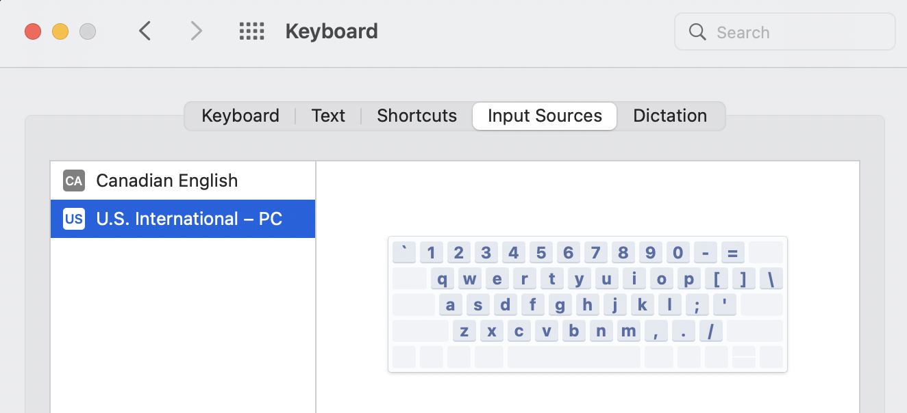
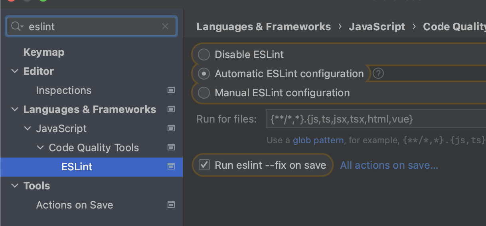
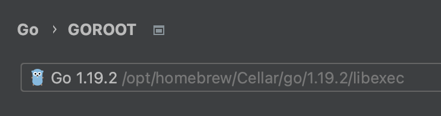
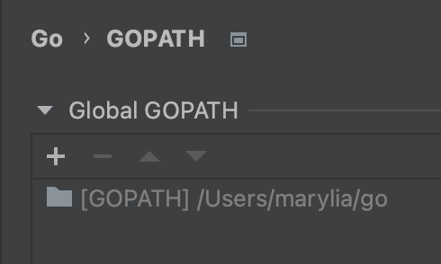
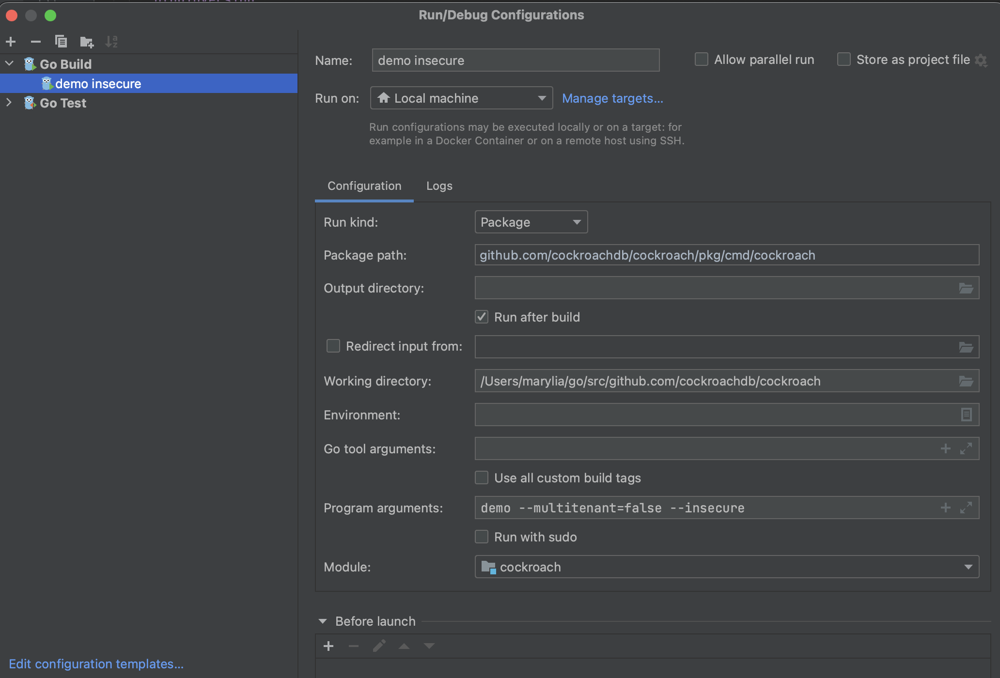

# General Setup
- Browser ([Chrome](https://www.google.com/intl/en_ca/chrome/)/[Firefox](https://www.mozilla.org/en-CA/firefox/new/))
- Password Management ([1Password](https://1password.com/downloads/mac/)/[LastPass](https://lastpass.com/misc_download2.php))
- [Clipy](https://clipy-app.com/)
- [Logi options+](https://www.logitech.com/en-ca/software/logi-options-plus.html) 
  - Setup buttons on mouse
- [Caffeine](https://www.macupdate.com/app/mac/24120/caffeine)
- Install US International Keyboard


- System Preferences > Mission Control > Turn off `Automatically rearrange Spaces based on most recent use`
- System Preferences > Trackpad > Turn on `Mission Control > Swipe up with four fingers` 
- System Preferences > Trackpad > Turn on `App Exposé > Swipe down with four fingers`
- [Next Meeting](https://apps.apple.com/us/app/next-meeting/id1017470484?mt=12)
  - Adjust Text Length


# Development Setup
- [Iterm2](https://iterm2.com/)
- [Startship](https://starship.rs/)
- [Homebrew](https://brew.sh/)
- Create [zshrc](.zshrc) file
- Setup [github ssh](https://docs.github.com/en/authentication/connecting-to-github-with-ssh/adding-a-new-ssh-key-to-your-github-account)
- Setup github user
  ```
    ❯ git config --global user.name "maryliag"
    ❯ git config --global user.email "marylia@cockroachlabs.com"
    ```
- Create global gitignore 
  ```
  ❯ cat ~/.gitignore
  .DS_Store
  *.idea
  ```
- XCode and XCode command line tools
  `xcode-select --install`
- [Loom](https://www.loom.com/download)
- [Tuple](https://tuple.app/downloads/)

# CockroachDB specific setup
```
❯ brew install go
❯ brew install node
❯ brew install yarn
❯ brew install nvm
❯ brew install vault
```
- [GVM](https://github.com/moovweb/gvm)
- [Goland](https://www.jetbrains.com/go/download/#section=mac) (If installing on M1 make sure to change the dropdown to select the `Apple Silicon` option)
  - Follow the [tips](https://cockroachlabs.atlassian.net/wiki/spaces/ENG/pages/154206209/Goland+Tips+and+Tricks)
  - Exclude `bazel`
  - Turn on `eslint` on CRDB and Managed
  
  
  - Update GOROOT and GOPATH
  
  
  
  - Create run config (helpful for debugging)
  
  
- Clone [CRDB](https://github.com/cockroachdb/cockroach) and [Managed](https://github.com/cockroachlabs/managed-service)
- Follow [steps](https://cockroachlabs.atlassian.net/wiki/spaces/CRDB/pages/73204103/Building+from+source+on+macOS) from building CRDB
- Install [backport tool](https://cockroachlabs.atlassian.net/wiki/spaces/CRDB/pages/900005932/Backporting+a+change+to+a+release+branch)

  `go install github.com/benesch/backport@latest`
- [PR master](https://github.com/benesch/prmaster)
- [Google Cloud SDK](https://cloud.google.com/sdk/docs/downloads-interactive)
